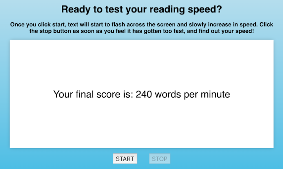

# Speed Read Test

## Description

A fun little application to test how fast you can read. Click start, and after a short countdown text will start to flash accross the screen and slowly increase in speed. Click the stop button as soon as you feel it has gotten too fast, and find out your speed!

## [Try it yourself!](https://bfeliz.github.io/speed-read-test/)

The following image shows a glimpse of the application:

## Getting Started

This is a simple application that runs right in the browser, no installation or downloads needed.

## Built With:

HTML  
CSS  
JavaScript

## Author:

Brittany Crosthwait

## Planned Updates

There are no plans to further update this application at this time.
